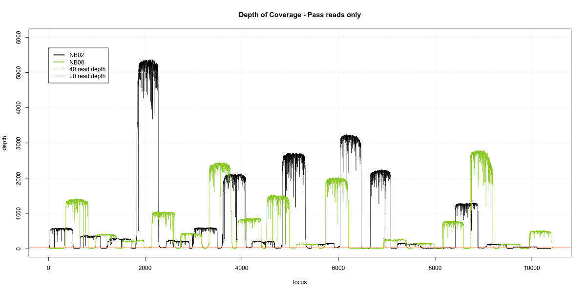
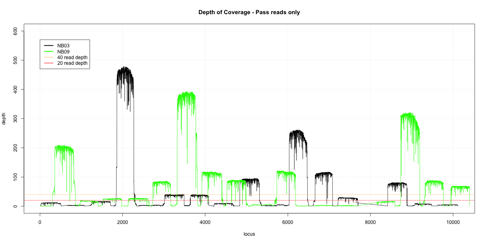
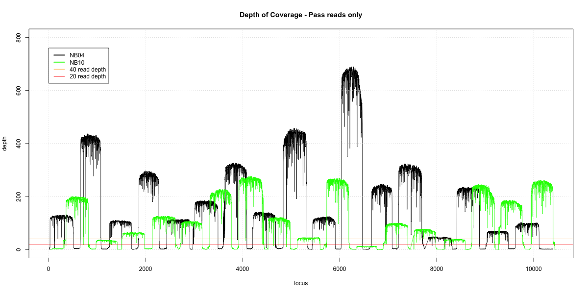
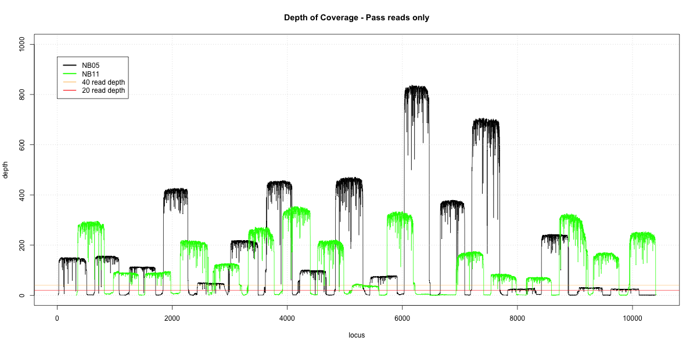
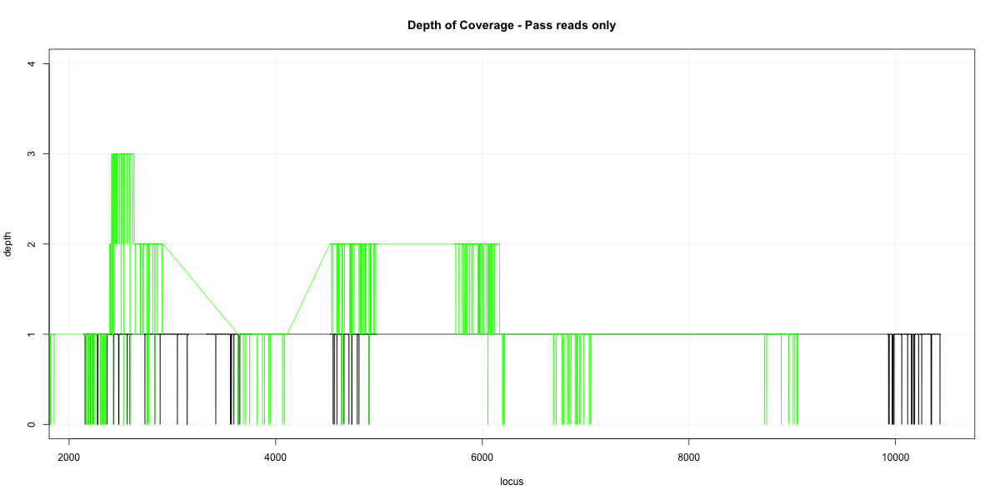
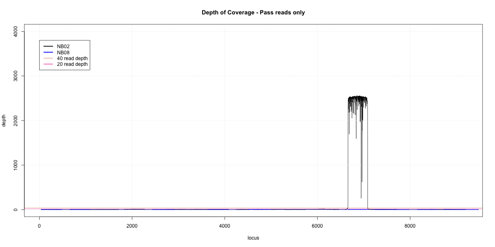
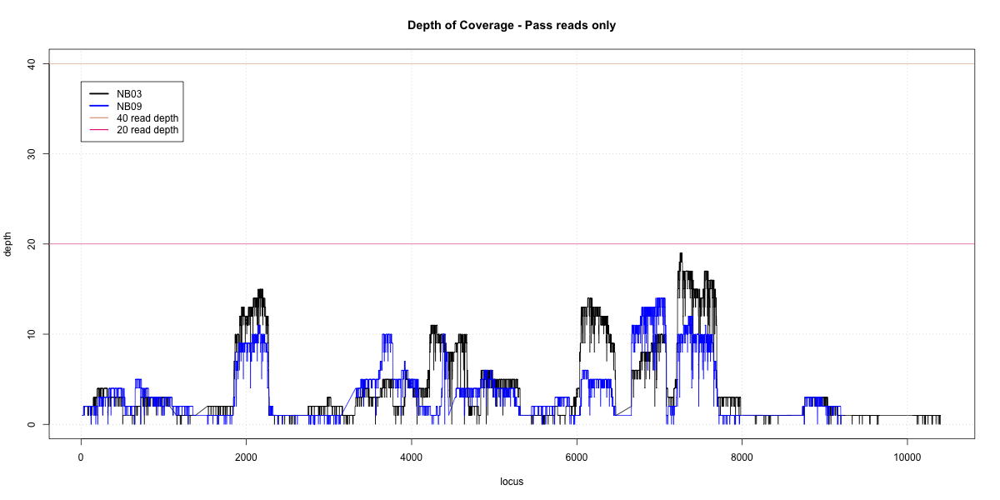
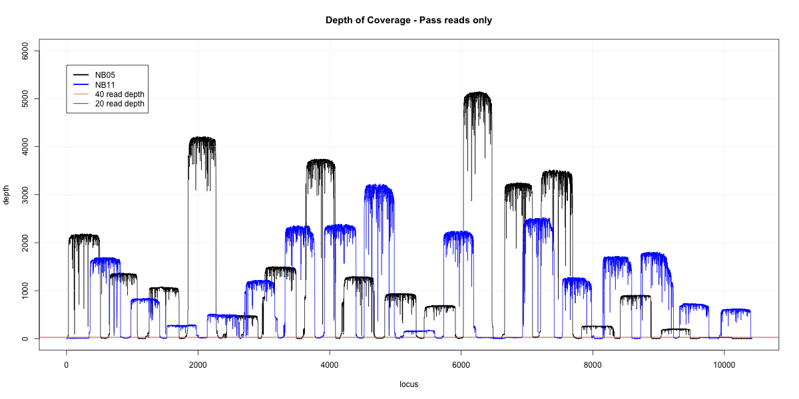

## Overlap Graphs
### To prepare libraries for this pipeline:
1. `poretools fasta --type 2D <path/to/base/called/reads/> > <name.fasta>`
2. `bwa mem -x on2d <indexed_reference.fasta> <name.fasta> | samtools view -bS - | samtools sort -o <name.sorted.bam> -`
3. `samtools depth <name.sorted.bam> > <name.coverage>`
  - `head <name.coverage>` # This finds the name of the 'chromosome'; there may be >1.
4. `awk '$1 == "<chromosomename>" {print $0}' <name.coverage> > chr1.coverage`
5. Repeat for paired library
6. Fill in <name1> and <name2> into pool1 and pool2 in `depth_coverage.R`
7. Stats acquired using `poretools stats <path/to/base/called/reads`

Reported p20 and p40 values represent percentage of the Zika genome which has at coverage of at least 20/40 reads, respectively.

### Overlap graphs and stats on `pass` libraries: USVI Library 1
#### NB01-NB07 Overlap

##### Complete library
* p20: 0.9815 (+1%)
* p40: 0.9758 (+1%)
  * Difference: 1%

##### Incomplete library
* p20: 0.9702
* p40: 0.9671

#### NB02-NB08 Overlap

##### Complete library
* p20: 0.9732 (+13%)
* p40: 0.9631 (+25%)
  * Difference: 1%

##### Incomplete library
* p20: 0.8412
* p40: 0.7145

#### NB03-NB09 Overlap

##### Complete library
* p20: 0.9191 (+25%)
* p40: 0.8723 (+37%)
  * Difference: 4%

##### Incomplete library
* p20: 0.6571
* p40: 0.5022

#### NB04-NB010 Overlap

##### Complete library
* p20: 0.9932 (+6%)
* p40: 0.9925 (+9%)
  * Difference: 0.1%

##### Incomplete library
* p20: 0.9384
* p40: 0.9087

#### NB05-NB11 Overlap

##### Complete library
* p20: 0.9779 (+7%)
* p40: 0.9749 (+10%)
  * Difference: 0.5%

##### Incomplete library
* p20: 0.9066
* p40: 0.8737

#### NB06-NB12 Overlap

##### Complete library
* p20: 0.0163 (+1%)
* p40: 0 (+0%)
  * Difference: 1%

##### Incomplete library
* p20: 0
* p40: 0

### Overlap graphs and stats on `pass` libraries: USVI Library 3
#### NB01-NB07 Overlap

p20: 0.2896
p40: 0.2658

#### NB02-NB08 Overlap

p20: 0
p40: 0

#### NB03-NB09 Overlap

p20: 0.0925
p40: 0

#### NB04-NB10 Overlap

p20: 0.3825
p40: 0.3624

#### NB05-NB11 Overlap

p20: 0.974
p40: 0.9675

#### NB06-NB12 Overlap

p20: 0
p40: 0
