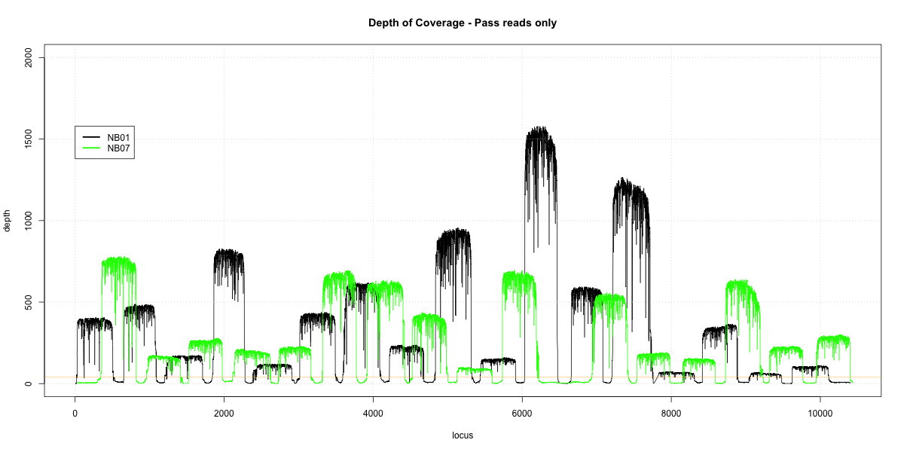
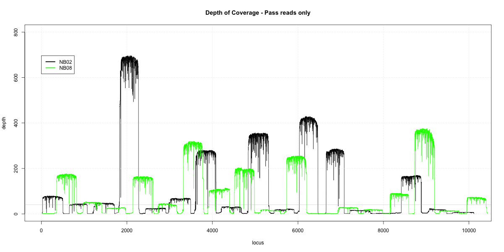
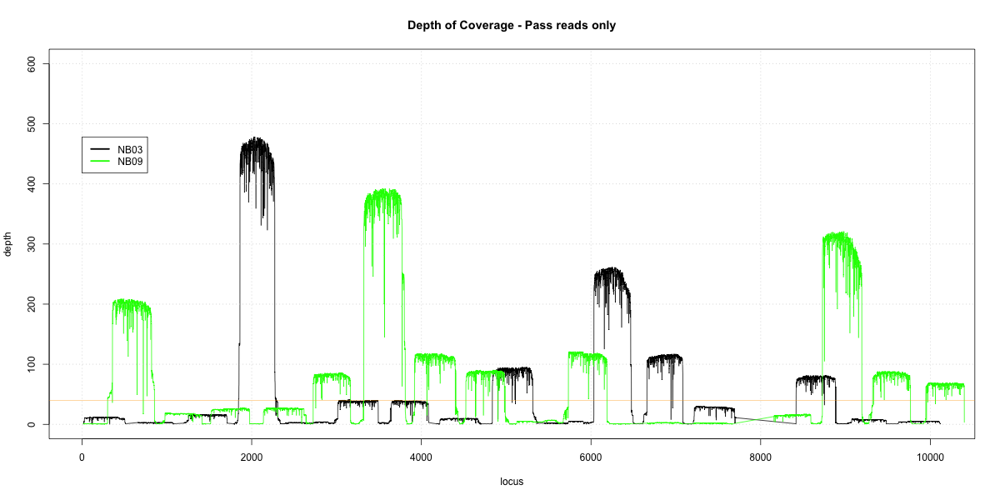
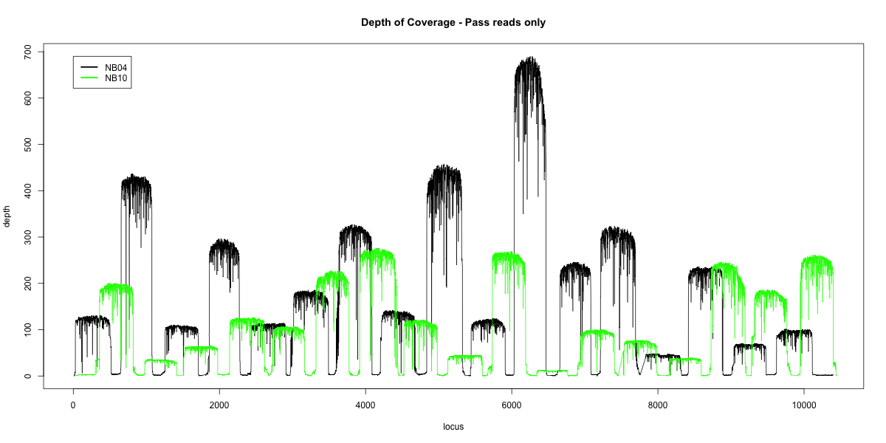
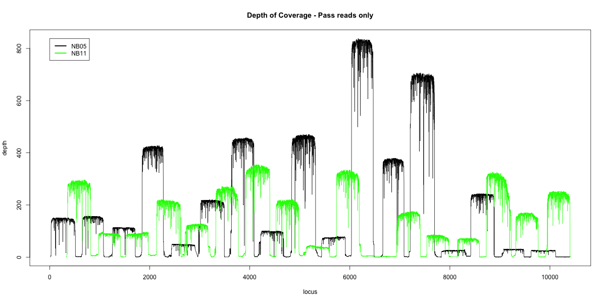
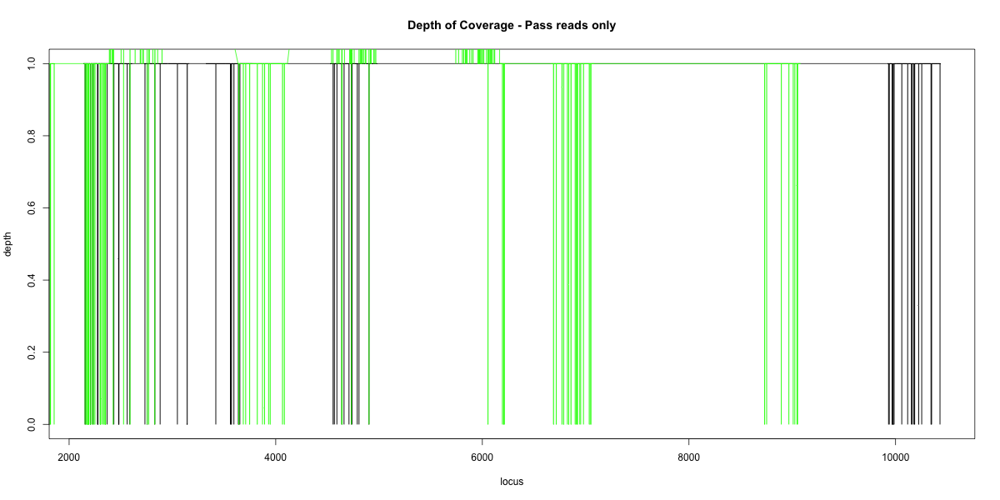

### Overlap Graphs
#### To prepare libraries for this pipeline:
1. `poretools fasta --type 2D <path/to/base/called/reads/> > <name.fasta>`
2. `bwa mem -x on2d <indexed_reference.fasta> <name.fasta> | samtools view -bS - | samtools sort -o <name.sorted.bam> -`
3. `samtools depth <name.sorted.bam> > <name.coverage>`
  - `head <name.coverage>` # This finds the name of the 'chromosome'; there may be >1.
4. `awk '$1 == "<chromosomename>" {print $0}' <name.coverage> > chr1.coverage`
5. Repeat for paired library
6. Fill in <name1> and <name2> into pool1 and pool2 in `depth_coverage.R`
7. Stats acquired using `poretools stats <path/to/base/called/reads`

#### Overlap graphs and stats on `pass` libraries
##### NB01-NB07 Overlap

|                 	| NB01     	| NB07     	|
|------------------	|---------	|---------	|
| total reads      	| 9729    	| 7530    	|
| total base pairs 	| 5225355 	| 3992373 	|
| mean             	| 537.09  	| 530.20  	|
| median           	| 547     	| 550     	|
| min              	| 213     	| 201     	|
| max              	| 1781    	| 1827    	|
| N25              	| 580     	| 577     	|
| N50              	| 552     	| 555     	|
| N75              	| 520     	| 508     	|

##### NB02-NB08 Overlap

|                 	| NB02     	| NB08     	|
|------------------	|---------	|---------	|
| total reads      	| 8277    	| 6462    	|
| total base pairs 	| 4402300 	| 3463771 	|
| mean             	| 531.87  	| 536.02  	|
| median           	| 541     	| 554     	|
| min              	| 176     	| 213     	|
| max              	| 1721    	| 1309    	|
| N25              	| 570     	| 578     	|
| N50              	| 544     	| 558     	|
| N75              	| 518     	| 523     	|

##### NB03-NB09 Overlap

|                 	| NB03     	| NB09     	|
|------------------	|---------	|---------	|
| total reads      	| 3618    	| 4845    	|
| total base pairs 	| 1888020 	| 2638147 	|
| mean             	| 521.84  	| 544.51  	|
| median           	| 531     	| 557     	|
| min              	| 265     	| 277     	|
| max              	| 1662    	| 1696    	|
| N25              	| 562     	| 579     	|
| N50              	| 535     	| 561     	|
| N75              	| 501     	| 531     	|

##### NB04-NB010 Overlap

|                 	| NB04    	| NB10    	|
|------------------	|---------	|---------	|
| total reads      	| 12381   	| 7224    	|
| total base pairs 	| 6450344 	| 3853127 	|
| mean             	| 520.99  	| 533.38  	|
| median           	| 538     	| 550     	|
| min              	| 192     	| 207     	|
| max              	| 1939    	| 2260    	|
| N25              	| 575     	| 577     	|
| N50              	| 544     	| 555     	|
| N75              	| 498     	| 514     	|

##### NB05-NB11 Overlap

|                 	| NB05    	| NB11    	|
|------------------	|---------	|---------	|
| total reads      	| 13479   	| 9558    	|
| total base pairs 	| 7376656 	| 5043864 	|
| mean             	| 547.27  	| 527.71  	|
| median           	| 551     	| 549     	|
| min              	| 183     	| 168     	|
| max              	| 1846    	| 1874    	|
| N25              	| 578     	| 578     	|
| N50              	| 554     	| 555     	|
| N75              	| 530     	| 504     	|

##### NB06-NB12 Overlap

|                 	| NB06    | NB12   	|
|------------------	|--------	|-------- |
| total reads      	| 81     	| 33     	|
| total base pairs 	| 28077  	| 16649  	|
| mean             	| 346.63 	| 504.52 	|
| median           	| 323    	| 517    	|
| min              	| 145    	| 322    	|
| max              	| 600    	| 596    	|
| N25              	| 518    	| 574    	|
| N50              	| 341    	| 546    	|
| N75              	| 302    	| 476    	|
